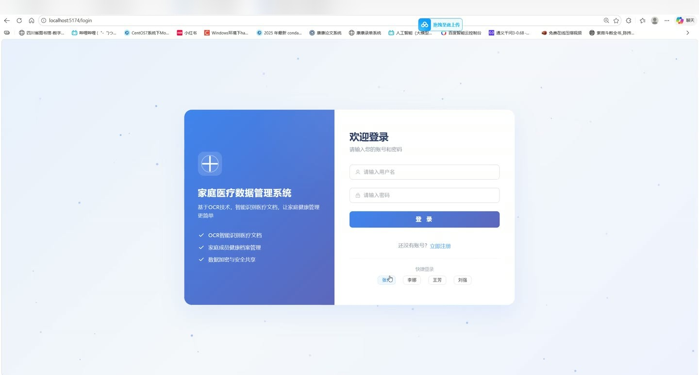
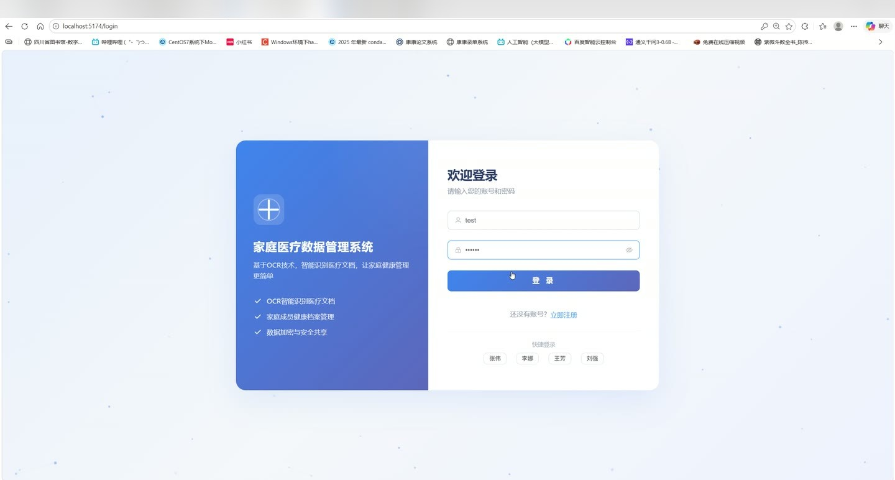
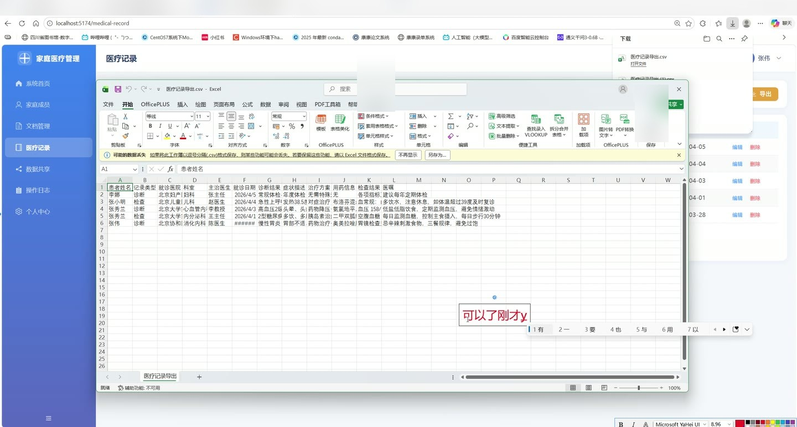
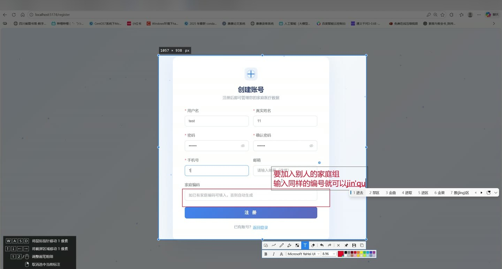
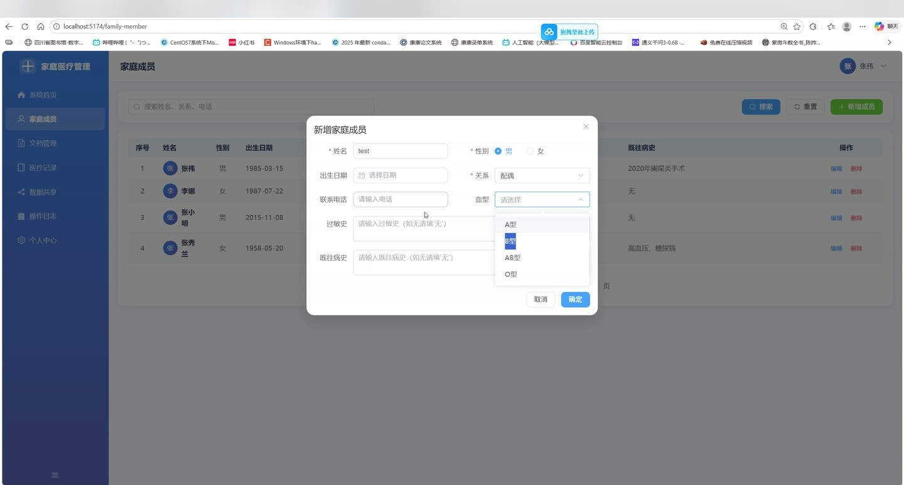
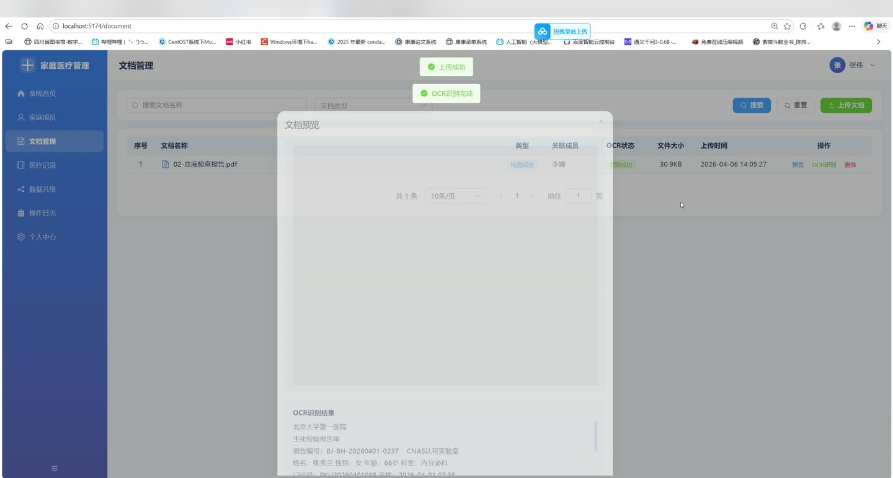

# (附文档)Springboot3+Vue3+MySQL 基于 OCR 技术的家庭医疗数据管理系统

**技术栈**：Springboot3、Vue3、MySQL

### 系统简介

本系统是一套基于 Spring Boot 3 + Vue 3 + MySQL 的 OCR 家庭医疗数据管理平台，采用前后端分离架构。系统以家庭为单位，支持家庭成员管理、医疗记录维护、医疗文档上传与 OCR 智能识别、数据外部共享以及操作日志审计。主要面向普通家庭成员（用户端）和系统管理员两个角色，帮助家庭实现医疗数据的数字化集中管理。
 
### 核心功能
 
### 普通用户端

 
- 用户注册与登录：通过用户名和密码完成注册登录，登录后返回 JWT Token 用于后续身份认证。 
- 个人信息管理：查看和编辑个人资料（真实姓名、手机号、邮箱、头像），支持修改密码（需验证旧密码）。 
- 家庭成员管理：新增/编辑/删除家庭成员，填写姓名、性别、出生日期、与户主关系、联系电话、血型、过敏史和既往病史。 
- 家庭成员列表查询：支持分页展示，可按关键词（姓名/关系/电话）模糊搜索家庭成员。 
- 医疗记录管理：新增/编辑/删除医疗记录，填写就诊医院、科室、主治医生、就诊日期、诊断结果、症状描述、治疗方案、用药信息、检查结果和医嘱。 
- 医疗记录列表查询：支持分页展示，可按关键词（诊断/医院/医生/症状）、记录类型（诊断/检查/处方/手术）、关联成员进行筛选。 
- 医疗记录详情查看：点击单条记录可查看完整详情，包括所有字段信息及关联成员姓名。 
- 医疗记录导出：将当前家庭的全部医疗记录导出为 UTF-8 编码的 CSV 文件，兼容 Excel 打开，包含患者姓名、记录类型、就诊医院等 12 个字段。 
- 医疗文档上传：选择关联成员、文档类型（处方/检查报告/诊断书/其他），上传图片或 PDF 文件（单文件最大 50MB），系统自动保存到按日期分目录的存储路径。 
- 医疗文档列表查询：支持分页展示，可按文档名称和文档类型筛选，表格显示文档名称、类型、关联成员、OCR 状态、文件大小、上传时间。 
- OCR 智能识别：对已上传的文档（图片或 PDF）发起 OCR 识别，图片调用百度 OCR API 提取文字，PDF 使用 PDFBox 直接提取文本，识别结果保存至文档记录。 
- 文档预览与 OCR 结果查看：支持图片预览和 PDF 内嵌预览，同时展示该文档的 OCR 识别文本内容。 
- 数据外部共享：选择一条医疗记录生成共享链接（可设置有效期天数），系统自动生成 16 位共享码，外部人员通过该链接可查看医疗记录详情。 
- 共享记录管理：查看已创建的共享链接列表（含分享者、过期时间、状态），支持撤销共享或自动过期标记。 
- 操作日志查询：查看当前家庭所有用户的操作日志，支持按操作名称、用户名、请求方法关键词搜索，列表展示操作类型、请求方法、参数、IP、耗时、状态。 
- 同家庭用户查看：获取同一家庭编码下的其他用户列表，用于选择共享对象等场景。
 
### 管理员端

 
- 用户管理：分页查询所有系统用户，支持按用户名、真实姓名、手机号关键词搜索。 
- 用户状态管理：可查看用户账号状态（启用/禁用），支持对用户进行启用或禁用操作。
 
### 技术栈

 后端框架Spring Boot 3.x ORM 框架MyBatis-Plus（含分页插件 PaginationInnerInterceptor） 权限认证JWT（jjwt 生成 Token，JwtInterceptor 拦截器校验） 密码加密BCrypt（hutool-crypto） 前端框架Vue 3（Composition API + script setup） UI 组件库Element Plus 状态管理Vue Router（路由守卫控制页面访问权限） 构建工具Vite 数据库MySQL（逻辑删除字段 deleted） OCR 识别百度 OCR API（accurate_basic 高精度版）+ Apache PDFBox（PDF 文本提取） 文件存储本地文件系统（按日期分目录，通过静态资源映射对外提供访问） 数据导出CSV（UTF-8 BOM 头，兼容 Excel）
 
### 交付内容

 
- 后端完整源码 
- 前端完整源码 
- 数据库初始化脚本 
- 万字文档

## 界面展示

---

## 获取完整源码 + 万字文档

本仓库为项目介绍页。**完整前后端源码、数据库初始化脚本、万字项目文档**，请加微信 `kangkangcode`，或访问 [codekk.top](http://codekk.top) 获取。

可作课程设计 / 毕业设计参考，支持远程部署调试。